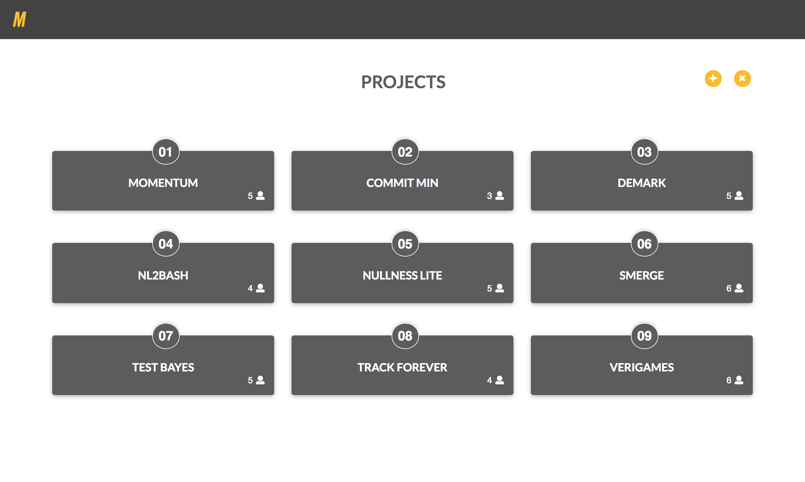
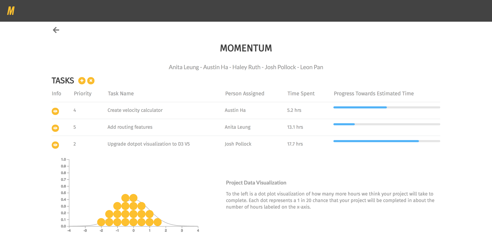

# Momentum User Manual
[_Manual version 0.1_]

## What's Momentum?
Momentum is a GUI tool that helps teams gain insight into the effort needed to complete a specified project. From a high level, there are two main stages that a user will go through when using _Momentum_:

1. Project Breakdown
2. Effort Tracking

In _Project Breakdown_, teams must provide _Momentum_ with information about their project (e.g. tasks, effort estimates, etc.). In _Effort Tracking_, each user must track the actual amount of time they spend on each task they work on.

We will discuss these processes in more detail later (See "Momentum Manifesto" section below).

## What will Momentum do for me?
_Momentum's_ goal is to provide your team with a **lightweight tool** that creates **realistic and accurate estimates** of the amount of time it will take to complete your project.

## Accessing Momentum
_Momentum_ is a webapp that can be found at [cse403-momentum.github.io/MOMENTUM](https://cse403-momentum.github.io/MOMENTUM/), where you can sign up for an account or sign in if you already have one. No installation is needed.

## Momentum Information Hierarchy
Momentum's fundamental component is the Project. A Project can be broken into two main sub-components: Users (team members) and Tasks (Figure 1).

*Figure 1. Conceptual Momentum Project structure*

### Users
A Project contains some set of Users -- these are members of a team that will be working on this Project. We will occasionally refer to this set of Users within a Project as the "team" that is associated with it.

### Tasks & Task List
Any given project has a set of Tasks. Individual Tasks have several key properties:
- Task title/description
- Task assignee
- Task priority
- User-estimated task effort (i.e. the amount of effort, in hours, the user thinks this task requires to complete)
- User-recorded time spent on task (i.e. the actual amount of time the user has spent on this task to date)

Of course, any single task should not define a Project. When a Project is created, a team should sit down and break down their entire Project into tasks that can be completed in 16 hours or less (by their estimate). This process helps teams work through their project architecture, and allows _Momentum_ to create an ship date estimate distribution.

## Momentum Usage
### Momentum Manifesto: What you should know before using Momentum
Momentum works based on three central kinds of user input:
- Tasks
- Task effort estimates
- Task effort actuality

Tasks are actionable items that can be completed in 16 hours or less (by the User's estimate). Projects contain a list of Tasks, and this list must be as comprehensive as possible. Therefore, it is important when using _Momentum_ to make sure you have thought through what it will actually _take_ to get your Project done. This is something that, in most cases, should be completed with the anticipated Team that will be working on a Project.

In _Momentum_, Tasks are always assigned to a **single** User. Once a Task is assigned to a User, that User must estimate how long it will take to complete that Task to the best of their ability. **It is OK if their estimate is totally wrong**, as _Momentum_ accounts for (and is, in fact, designed around) User error. Again, User accuracy is not what is important here..._User thoughtfulness is_.

Finally, Users must track how long it actually takes them to complete a Task. As mentioned above, _Momentum_ expects that their estimates will not be perfect (or even close, for that matter!), but will use their estimate in conjunction with their actual effort in order to create a model that can accurately predict effort for their whole team. Users should not feel constrained by their estimates, and shouldn't feel rushed to complete a Task within a their estimated time.

### Signup/Login
Users are required to be signed in to an account in order to use _Momentum_.

You may sign up for a new account at [cse403-momentum.github.io/MOMENTUM/join](https://cse403-momentum.github.io/MOMENTUM/join).

If you already have an account, you may log in at [cse403-momentum.github.io/MOMENTUM/login](https://cse403-momentum.github.io/MOMENTUM/login).

### Creating and Managing Projects
After you've signed in, the landing page is your _Projects_ page (Figure 2). Here, you have the option to enter a specific Project or create a new Project. Project titles and number of team members are displayed.

*Figure 2. Projects overview page*

#### Making a new Project
From the _Projects_ page, you can create a new Project by clicking the "+" button at the top of the page.

You will then be prompted to invite other Users to work on your project and will be asked to begin a Project breakdown (See "Momentum Manifesto" above).

#### Working on an existing Project
To enter a specific project, click on its card. You will be brought to your Project's home page, where a list of Tasks and their information are displayed (Figure 3). Additionally, statistics and projected ship dates are displayed so that the team has context on its progress.

*Figure 3. Specific Project home page*

You may create new Tasks from this page as well. This is done by clicking the "+" button near the top of the page. Figure 4 shows the Task creation screen, where you will enter a Task name, description, priority, and assignee (who will, in turn, enter an effort estimate in hours).

*Figure 4. Task creation view*

To view more information about a Task, and to perform certain actions on that Task, you can click on it in the Task list. (See "Tracking Effort" section below for more information on Task manipulation.)

### Tracking Effort
Clicking on a Task from a Project's home page will bring you to a detailed view of that Task (Figure 5), and will allow you track time spent on the Task or mark that Task as completed. **It is crucial that an estimate has been made _before_ a User begins working on a Task, and it is equally crucial that the User begins and ends time tracking for that task appropriately.**

*Figure 5. Task detail view*

### Getting a Ship Date Distribution
If you have:
- Broken your entire Project into Tasks as described in the "Manuscript Manifesto" (above)
- Assigned each Task to a User on the team
- Made sure each User has faithfully entered their best effort estimate for each Task
- Made sure each User has tracked their time spent on each Task

You should be able to view a projected effort distribution for a specific Project from that Project's home page. You may view distribution charts that display likely effort (in person-hours, for example), remaining User workload, potential product ship dates, and more.